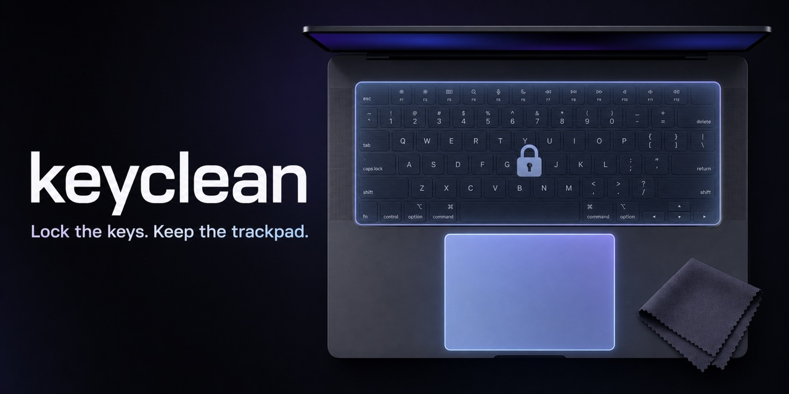

# keyclean

[](https://github.com/lan-shengchieh/keyclean/actions/workflows/ci.yml)
[](https://github.com/lan-shengchieh/keyclean/releases/latest)
[](https://github.com/lan-shengchieh/keyclean/stargazers)
[](LICENSE)

[English](README.md)



鎖住鍵盤、保留觸控板，清潔 MacBook 時不再誤觸按鍵。

`keyclean` 是一個小巧、開源的 macOS 命令列工具。執行期間會暫時攔截
鍵盤輸入，但仍可使用觸控板與滑鼠；按下解鎖快捷鍵或結束程式後，鍵盤
就會恢復正常。

不同於全螢幕清潔模式，`keyclean` 適合清潔鍵盤時仍想操作游標的人：它
只在需要時從終端機啟動，不安裝背景服務，而且只有一個可直接檢查的
Swift 原始碼檔。

## 安裝

```sh
brew install lan-shengchieh/tap/keyclean
```

接著執行：

```sh
keyclean
```

按下 **Control + Option + Command + U**（`⌃⌥⌘U`）即可解鎖。你也可以用
觸控板關閉 Terminal 視窗；程序結束時 event tap 會一併移除，鍵盤輸入
也會恢復。

## 第一次執行

macOS 可能會要求你授予啟動 `keyclean` 的終端機「輔助使用」權限：

**系統設定 → 隱私權與安全性 → 輔助使用**

啟用 Terminal、iTerm2，或你實際使用的終端機程式後，再執行一次
`keyclean`。

## 執行時的行為

| 輸入方式 | `keyclean` 執行期間 |
| --- | --- |
| 一般按鍵與修飾鍵 | 攔截 |
| session event tap 可偵測到的媒體／系統按鍵 | 攔截 |
| 觸控板與滑鼠 | 可正常使用 |
| `⌃⌥⌘U` | 解鎖並結束程式 |

Touch ID 與實體電源鍵不在本工具的保證範圍內。

## 刻意保持簡單

- 只有一個 Swift 原始碼檔，不依賴第三方套件。
- 不連網、不蒐集分析資料、不常駐背景，也不儲存任何資料。
- 程序結束時，鍵盤輸入會自動恢復。
- 透過 GitHub Actions 在 macOS 上建置與測試。

想了解 event tap、權限、隱私界線與復原方式，可閱讀
[keyclean 的運作原理](docs/how-keyclean-works.zh-TW.md)。

## 從原始碼建置

需求：macOS，以及包含 Swift 的 Apple Command Line Tools。

```sh
git clone https://github.com/lan-shengchieh/keyclean.git
cd keyclean
make test
```

將本機建置的執行檔安裝到 `~/.local/bin`：

```sh
make install
```

## 疑難排解

**出現 `could not create the keyboard event tap`**

請授予啟動 `keyclean` 的終端機「輔助使用」權限；如仍無法使用，可先
關閉並重新開啟該終端機，再試一次。

**鍵盤仍處於鎖定狀態**

請按下 `⌃⌥⌘U`。若沒有反應，可用觸控板關閉 Terminal 視窗；程序結束
後 event tap 就會被移除。

## 參與貢獻

歡迎回報錯誤、提供不同 macOS 版本的相容性結果，或送出範圍明確的
pull request。本機測試指令請參考 [CONTRIBUTING.md](CONTRIBUTING.md)。

如果你在不同 macOS 版本、Mac 架構或終端機上測試過 `keyclean`，歡迎
[提交相容性報告](https://github.com/lan-shengchieh/keyclean/issues/new?template=compatibility_report.yml)。

如果 `keyclean` 對你有幫助，也歡迎分享給其他 Mac 使用者。

- 如果你想追蹤正式進入 Homebrew 的進度，可以
  [Star 這個 repository](https://github.com/lan-shengchieh/keyclean)。
- 將一行安裝指令分享給可能需要的 Mac 使用者。
- 使用 [launch kit](SHARE.md) 裡已準備好的中英文文案與圖片。

相容性測試與 `homebrew/core` 里程碑請見公開的 [roadmap](ROADMAP.md)。

## 授權

[MIT](LICENSE)
